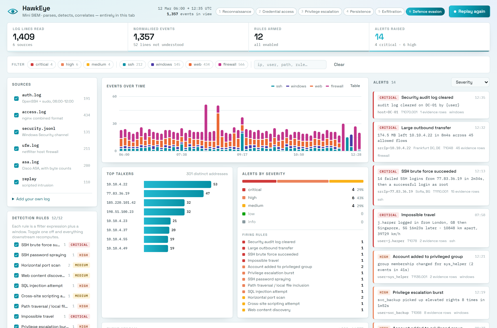

# HawkEye

A small SIEM that runs entirely in a browser tab. It reads raw log text, normalises it into
one event schema, runs a set of detection rules over the stream, correlates the matches into
alerts, and draws the result as a SOC console.

**[Open it →](https://white-venom.github.io/hawkeye-siem/)**

No backend, no API keys, no network calls except the two font files. Everything — parsing,
detection, correlation — happens on the client.



## Why it exists

Most SIEM demos are a screenshot of a dashboard. The interesting part of a SIEM isn't the
dashboard, it's the bit in the middle: turning a pile of unstructured text into "this account
was used from two continents in sixteen minutes". So the parsers, the rule engine and the
correlation logic are the actual project here. They're DOM-free modules with tests, and the
UI is a client of them rather than the other way round.

## The pipeline

```
raw text ──▶ parser ──▶ LogEvent ──▶ rule engine ──▶ matches ──▶ correlation ──▶ alerts
```

Every source collapses into the same shape, and nothing downstream ever sees a log line again:

```ts
{ ts, source, action, status, raw, srcIp?, user?, port?, path?, eventId?, bytes?, ... }
```

`status` is deliberately a small closed set — `success | failure | blocked | allowed | error |
info` — so a rule can say `status = failure` without knowing whether it's reading OpenSSH,
nginx or a Cisco ASA.

### Parsers

| Source | Format | Notes |
|---|---|---|
| `ssh` | Debian/Ubuntu `auth.log` | OpenSSH and `sudo`. Handles the four different ways OpenSSH spells "that login failed", including the `pam_unix` variant. |
| `web` | NCSA combined | nginx/Apache. The path is URL-decoded before rules see it, so `%2e%2e%2f` doesn't slip past a traversal signature. |
| `windows` | Security channel as JSON lines | winlogbeat-ish shape. Maps the dozen event IDs a small SOC actually watches; unknown IDs are kept, not dropped. |
| `firewall` | netfilter/UFW **and** Cisco ASA | Two device families, one normaliser. ASA is in there because it's the only one of the two that reports byte counts, which is what the exfil rule needs. |

Anything a parser can't make sense of goes into a `skipped` list with its line number rather
than being silently discarded — the console shows the count. The bundled `auth.log` has cron
lines in it precisely so that number isn't zero.

Timestamps are parsed as **UTC**. Real syslog is in the host's local zone, but pinning it makes
the tests deterministic and stops the same incident having two timelines.

Syslog lines carry no year, so `parse()` takes one (`{ year: 2025 }` for the bundled data).
Without it the ssh and firewall sets drift a year away from the web and Windows ones and
nothing correlates.

## The rule DSL

Rules are data. The matching half is a filter expression — a real recursive-descent parser in
[`src/core/rules/dsl.ts`](src/core/rules/dsl.ts), about 250 lines, no dependencies:

```
source = ssh and status = failure
path ~ "union[\s/*]+select" or path contains "../"
eventId in [4728, 4732, 4720] and not user = SYSTEM
httpStatus >= 400 and bytes exists
```

Operators: `= != > < >= <=`, `~` / `!~` (regex), `contains`, `in [...]`, `exists`, plus
`and` / `or` / `not` and parentheses. Comparison is loose about string-vs-number so
`httpStatus = "404"` and `httpStatus = 404` both work. A missing field is never an error, it
just doesn't match — which is what you want when one rule runs across four sources.

The windowing half is one of three detectors:

- **`threshold`** — N events in a sliding window, grouped by a key. `distinct: 'port'` counts
  unique values instead of rows (port scans); `sum: 'bytes'` totals a field instead (exfil).
- **`sequence`** — ordered steps that all have to land in one window for the same key. This is
  what turns "lots of failed logins" into "and then they got in".
- **`geo_velocity`** — same principal, two locations, not enough time in between.

A rule, end to end:

```ts
{
  id: 'ssh-brute-force',
  severity: 'critical',
  mitre: { id: 'T1110.001', name: 'Brute Force: Password Guessing' },
  narrative: '{failed} failed SSH logins from {srcIp} in {span}, then a successful login as {user}',
  detect: {
    type: 'sequence',
    groupBy: ['srcIp'],
    within: '10m',
    steps: [
      { label: 'failed',   where: 'source = ssh and status = failure', count: 8 },
      { label: 'accepted', where: 'source = ssh and action = login and status = success' },
    ],
  },
}
```

`narrative` is the alert headline; placeholders are filled from the match (`{count}`, `{span}`,
`{distinct}`, `{mb}`, the groupBy fields, and per-step counts by their label).

### Shipped rules

| Rule | Severity | ATT&CK | Fires on |
|---|---|---|---|
| SSH brute force succeeded | critical | T1110.001 | 8+ failures from one address, then a success |
| Impossible travel | critical | T1078 | one account, ≥700 km apart, ≥900 km/h implied |
| Security audit log cleared | critical | T1070.001 | Windows event 1102 |
| Large outbound transfer | critical | T1048 | ≥20 MB out of one internal host in 10m |
| SSH password spraying | high | T1110.003 | 6+ distinct accounts failing from one address |
| SQL injection attempt | high | T1190 | SQLi signatures in the request path |
| Path traversal / LFI | high | T1083 | `../../`, `/etc/passwd`, `/proc/self/environ` |
| Privilege escalation burst | high | T1068 | 6+ privilege grants for one principal in 5m |
| Account added to privileged group | high | T1136.001 | Windows 4720 / 4728 / 4732 |
| Horizontal port scan | medium | T1046 | 15+ distinct blocked ports from one address |
| Web content discovery | medium | T1595.003 | 20+ distinct 404 paths from one client |
| Cross-site scripting attempt | medium | T1059.007 | script tags and inline handlers in a query |

Thresholds are tuned so the demo dataset is interesting, not for a real estate with real
traffic. On a production edge you'd want the port-scan count an order of magnitude higher and
an allowlist for your own scanners. The rules that would need re-tuning first say so in their
descriptions.

### Correlation

Matches aren't alerts. Correlation folds every match for the same `(rule, entity)` whose
windows touch into one alert, so a fourteen-attempt brute-force run is a single card carrying
fifteen evidence rows, not fourteen cards. Once the gap between matches exceeds the rule's own
window, a new alert opens.

## The console

Left rail is inputs (which sources are loaded, which rules are armed, paste your own log).
Middle is the data. Right is the alert feed. One filter row across the top scopes all of it.

The strip under the header is the whole point of the app in four numbers: lines read →
events normalised → rules armed → alerts raised. It moves while data streams in.

**Replay attack** streams a scripted intrusion through the same parsers, one raw line at a
time, in six phases: recon → credential access → privilege escalation → persistence →
exfiltration → clearing the logs. It takes about 18 seconds and lights up six more rules,
including the brute force and the 174 MB that leaves the box afterwards. Nothing about it is
special-cased — they're log lines going through the ordinary pipeline.

You can paste or drop your own log into the sources panel. It guesses the format and you can
override the guess.

## Running it

```
npm install
npm run dev       # vite dev server
npm test          # vitest, node, no browser
npm run build     # tsc --noEmit && vite build
```

`npm test` covers the parsers (field extraction, status mapping, timezone handling, round-trips,
what gets skipped), each rule against a known-positive and at least one known-negative, the
correlation windows including the off-by-one at the window edge, and an end-to-end pass that
asserts the bundled data trips exactly the rules its scenarios were written for. 101 tests. CI
runs them before it will deploy.

## About the data

All of it is synthetic and generated by [`scripts/gen-samples.mjs`](scripts/gen-samples.mjs)
from a fixed seed, so re-running it produces identical files. The datasets are committed; the
script is just how they got there. Public addresses are either RFC5737 documentation ranges or
hosting/VPN ranges that appear in the bundled geo table — none of it points at anyone real.

Everything is dated **12 March 2025, 06:00–12:41 UTC**. The bundled sources cover 06:00–12:00
and carry the impossible travel, the port scan, the directory sweep and the web attacks; the
replay incident picks up at 12:05.

The IP→geo lookup is a hand-built table in [`src/core/geo.ts`](src/core/geo.ts) — a real GeoIP
database is tens of megabytes and needs a licence key, neither of which belongs in a static
site. It covers the ranges the samples use; anything else returns nothing and the travel rule
stays quiet rather than guessing.

Private addresses are excluded from impossible travel on purpose. RFC1918 space geolocates to
wherever you put the datacentre, so without that check "logged in from the office, then from
Singapore" looks like teleportation every morning.

## Decisions I made without asking

- **Light theme.** The brief originally said dark; a white-and-cyan console was picked
  instead, so that's what's here. There's no dark mode — the tokens are all in one block at the
  top of `styles.css` if you want one.
- **Original timestamps, not rebased to now.** The chart opens on the March window rather than
  pretending the data is live. The replay appends to the same timeline so there's no gap.
- **The rule panel is read-only.** It shows each rule's real DSL and lets you arm/disarm it,
  which demonstrates the engine without the failure modes of a live expression editor.
- **Series colours aren't arbitrary.** They were run through a palette validator for
  colourblind separation against a white surface. There's a note in `src/ui/theme.ts` — re-run
  it if you change them.
- **Two fonts from Google Fonts** are the only external request. Everything else is bundled.

## What I'd do next

- Persist ingested logs and rule state to `localStorage` so a reload doesn't reset the console.
- Let a rule reference another rule's alerts, so "brute force succeeded *and then* data left"
  becomes one incident instead of two cards.
- Field-level tokenisation on paste, so an unknown format can be mapped in the UI rather than
  needing a new parser.
- The event table re-renders wholesale every tick; past a few thousand events that wants to be
  windowed.

## Layout

```
src/core/       DOM-free. Parsers, DSL, rule content, engine, geo. This is the project.
src/ui/         Canvas charts, formatting, colour tokens.
src/data/       The bundled datasets and the replay script.
src/main.ts     Wiring.
tests/          vitest, runs in node.
scripts/        The sample generator.
```

MIT.
